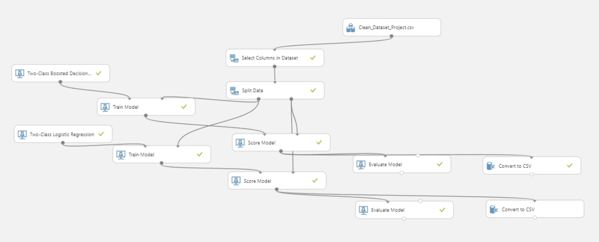

## Evaluation of Machine Learning Techniques used in Employee Attrition Rate

This project evaluates and compares two machine learning techniques (logistic regression and boosted decision tree) using Azure Machine Learning in classifying which attributes contribute to the employee attrition rate. The project also discusses the comparison of boosted decision tree and logistic regression in terms of its performance and results.

- Fields: 20  
- Rows: 4410  
- Data Size: 88200

## Keywords: 
### logistic regression, boosted decision tree, correlation, prediction, classification, azure machine learning, r language

Repository: [Evaluation of Machine Learning Techniques used in Employee Attrition Rate](https://github.com/arveeflores/Data-Analytics/tree/main/Other%20Projects/Employee%20Attrition%20Rate%20Project)