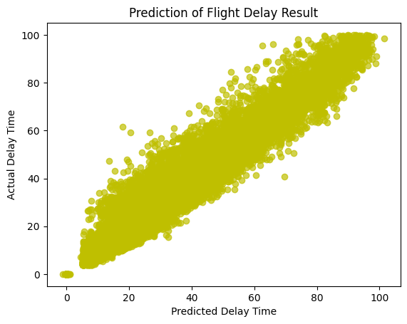

## Evaluation of Machine Learning Techniques used in Flight Delay Prediction

This project evaluates and compares machine learning techniques using Python in classifying if a flight is delayed or not and if in case it is, then it provides the minutes of the predicted delay time. The project also provides performance and results of each model used.

- Fields: 21  
- Rows: 100317  
- Data Size: 2106657

## Keywords:

### logistic regression, linear regression, correlation, prediction, classification, regression, python

Repository: [Flight Delay Prediction Project](https://github.com/arveeflores/Data-Analytics/tree/main/Other%20Projects/Flight%20Delay%20Prediction)
Jupyter Notebook: [Flight Delay Prediction Notebook](https://github.com/arveeflores/Data-Analytics/blob/main/Other%20Projects/Flight%20Delay%20Prediction/Project_AFl66643.ipynb)
