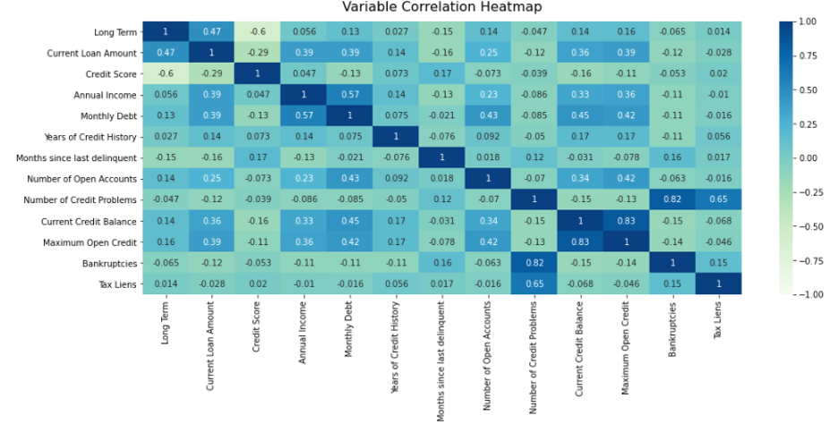

This project provides an exploratory analysis for bank loan dataset from Kaggle. It discusses how the attributes affect to the approved loan duration of the approved loan amounts. Through logistic regression using Python, the author was able to provide insights of which variables are suited for using a independent variables for this project.

This dataset contains information about approved bank loan applications.

  <ul>
    <li><b>Fields:</b> 18</li>
    <li><b>Rows:</b> 1000</li>
    <li><b>Data Size:</b> 18000</li>
  </ul>

  ## Keywords:
  ### python, pandas, numpy, matplotlib, seaborn, sklearn, logistic regression, correlation, prediction