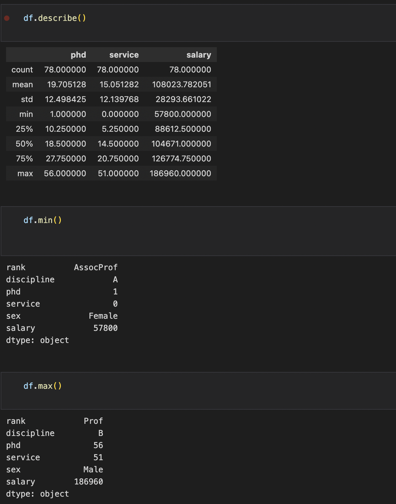

This mini project provides an exploratory analysis for salary of the dataset from Boston University. It showcases how the author provides information through the use of Jupyter Notebook in giving descriptive information of the dataset.

This dataset contains information about approved bank loan applications.

  <ul>
    <li><b>Fields:</b> 6</li>
    <li><b>Rows:</b> 78</li>
    <li><b>Data Size:</b> 468</li>
  </ul>

  ## Keywords:
  ### python, pandas, numpy, dataframe, data manipulation