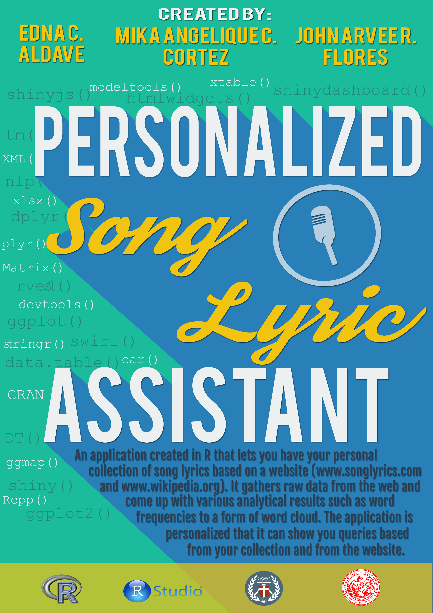

## Personal Song Lyrics Assistant

An application created in R that lets you have your personal collection of song lyrics based on a website (www.songlyrics.com and www.wikipedia.org). It gathers raw data from the web and come up with various analytical results such as word frequencies to a form of word cloud. The application is personalized that it can show you queries based from your collection and from the website.

## R Packages
### Interface Packages
- shiny
- shinydashboard
- svdialogs

### Web Scraping 
- downloader
- rvest

### Text & Data Manipulation
- stringr
- data.table

### Text Analysis
- nlp
- tm
- wordcloud
- sentiment

Repository: [Personal Song Lyrics Assistant](https://github.com/arveeflores/Data-Analytics/tree/main/R%20Projects/Personal%20Song%20Lyrics%20Assistant)